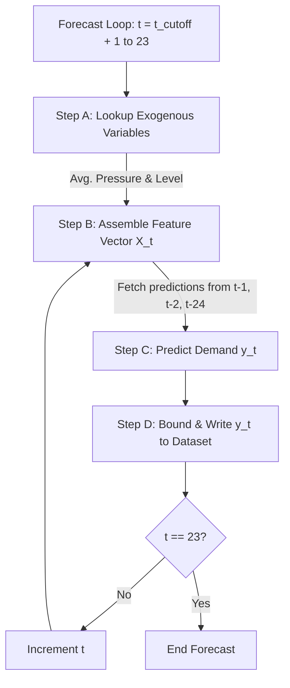

# Smart Water Demand Forecasting System: Mathematical & ML Core Documentation

This document provides a comprehensive technical overview of the machine learning engine, feature engineering pipelines, forecasting algorithms, and physical domain calculations powering the Water Demand Forecasting Application. 

---

## 1. Feature Engineering Mathematics

To transform raw timestamped SCADA flow rates into predictive inputs for the gradient boosting model, the system executes real-time feature extraction on the chronological dataset.

### A. Lag Features
Lag features capture the temporal autocorrelation of water demand. For any hourly target demand $y(t)$, the system generates lag terms representing historical observations:

$$\text{Lag}_k(t) = y(t - k)$$

The models use:
* **$\text{Lag}_1(t) = y(t - 1)$**: Immediate preceding hour demand. Represents short-term momentum.
* **$\text{Lag}_2(t) = y(t - 2)$**: Demand from two hours prior. Helps establish acceleration/deceleration.
* **$\text{Lag}_{24}(t) = y(t - 24)$**: Daily seasonality lag. Captures the demand at the exact same hour of the previous day (e.g., matching morning peaks at 08:00 AM).

### B. Rolling Windows
Rolling stats capture local trends and noise levels. To prevent target leakage during training and sequential prediction, rolling calculations are computed on a shifted window (excluding the active prediction step $t$):

$$\text{Rolling Mean}_w(t) = \frac{1}{w} \sum_{i=1}^{w} y(t - i)$$

$$\text{Rolling Std}_w(t) = \sqrt{\frac{1}{w-1} \sum_{i=1}^{w} \left( y(t - i) - \text{Rolling Mean}_w(t) \right)^2}$$

The engine implements a window size of $w = 3$ hours:
* **$\text{Rolling Mean}_3(t)$**: Smooths high-frequency noise and represents the current volume flow baseline.
* **$\text{Rolling Std}_3(t)$**: Captures short-term volatility or sudden demand surges/drops in the pipe network.

---

## 2. Machine Learning Model: XGBoost Regressor

The core model is an Extreme Gradient Boosting (XGBoost) Regressor, an optimized implementation of gradient boosted decision trees (GBDT).

### A. GBDT Objective Function
At each boosting iteration $m$, the model fits a new decision tree $f_m(x)$ to minimize the regularized objective function:

$$\mathcal{L}^{(m)} = \sum_{i=1}^{N} L\left(y_i, \hat{y}_i^{(m-1)} + f_m(x_i)\right) + \Omega(f_m)$$

Where:
* $N$ is the number of training observations.
* $L$ is the loss function (Mean Squared Error).
* $\hat{y}_i^{(m-1)}$ is the prediction at iteration $m-1$.
* $\Omega(f_m)$ is the regularization penalty to prevent model overfitting, defined as:

$$\Omega(f) = \gamma T + \frac{1}{2} \lambda \sum_{j=1}^{T} w_j^2$$

Here, $T$ represents the number of leaves in the tree, and $w_j$ is the weight of leaf $j$. $\gamma$ and $\lambda$ are regularization parameters.

### B. Taylor Expansion Approximation
XGBoost uses a second-order Taylor expansion to approximate the objective function at tree $m$, enabling rapid optimization:

$$\mathcal{L}^{(m)} \approx \sum_{i=1}^{N} \left[ L(y_i, \hat{y}_i^{(m-1)}) + g_i f_m(x_i) + \frac{1}{2} h_i f_m^2(x_i) \right] + \Omega(f_m)$$

Where:
* $g_i$ is the first-order gradient (residual):
  $$g_i = \frac{\partial L(y_i, \hat{y}_i^{(m-1)})}{\partial \hat{y}_i^{(m-1)}} = \hat{y}_i^{(m-1)} - y_i \quad \text{(for MSE loss)}$$
* $h_i$ is the second-order gradient (hessian):
  $$h_i = \frac{\partial^2 L(y_i, \hat{y}_i^{(m-1)})}{\partial (\hat{y}_i^{(m-1)})^2} = 1 \quad \text{(for MSE loss)}$$

The optimal weight $w_j^*$ for leaf node $j$ containing instance index set $I_j$ is calculated as:

$$w_j^* = -\frac{\sum_{i \in I_j} g_i}{\sum_{i \in I_j} h_i + \lambda} = -\frac{\sum_{i \in I_j} (\hat{y}_i - y_i)}{|I_j| + \lambda}$$

---

## 3. Sequential Autoregressive Multi-Step Forecasting

To predict the remaining hours of the current day (e.g. 15:00 → 23:00) when actual lag inputs are not yet available, the system implements a recursive sequential pipeline.

### The Recursive Algorithmic Loop
Let $t_{\text{cutoff}}$ be the last hour of available actual SCADA telemetry (e.g. 14:00). For each step $t$ from $t_{\text{cutoff}} + 1$ to $23$:

1. **Step A: Project Exogenous Context**
   Future pressure $P(t)$ and reservoir level $L(t)$ are set to their historical hourly averages:
   $$P_{\text{proj}}(t) = \frac{1}{|D_H|} \sum_{d \in D_H} P_d(t)$$
   $$L_{\text{proj}}(t) = \frac{1}{|D_H|} \sum_{d \in D_H} L_d(t)$$
   *Where $D_H$ is the set of all historical days in the database.*

2. **Step B: Assemble Autoregressive Features**
   Compile the input vector $X_t$:
   * Retrieve immediate past values: $\text{Lag}_1(t) = \hat{y}(t - 1)$ and $\text{Lag}_2(t) = \hat{y}(t - 2)$ (which are themselves previous forecasts).
   * Retrieve the daily baseline: $\text{Lag}_{24}(t) = y(t - 24)$ (which is an actual observation from yesterday).
   * Recompute rolling metrics:
     $$\text{Rolling Mean}_3(t) = \frac{\hat{y}(t-1) + \hat{y}(t-2) + \hat{y}(t-3)}{3}$$

3. **Step C: Compute Model Output**
   Run the XGBoost inference:
   $$\hat{y}(t) = \text{XGBoost}(X_t)$$

4. **Step D: Physical Boundary Constraints**
   Apply non-negative physical flow bounds:
   $$\hat{y}(t) = \max(0, \hat{y}(t))$$
   *The bounded prediction $\hat{y}(t)$ is written to the active timeline and feeds into the lag vector for step $t+1$.*

---

## 4. Physical Water Domain Calculations

The system performs chemical and hydraulic assessments of the distribution network.

### A. Volumetric Flow Integration
Water delivery is calculated by integrating flow rates over time. Since SCADA reports hourly average flow rates $Q(t)$ in $\text{m}^3/\text{hr}$, the daily total volume delivery $V$ (in $\text{m}^3$) is approximated using a Riemann sum with $\Delta t = 1$ hour:

$$V = \int_{0}^{24} Q(t) \, dt \approx \sum_{t=0}^{23} Q(t) \cdot \Delta t$$

*Today's delivery card displays $\sum_{t=0}^{t_{\text{cutoff}}} Q_{\text{actual}}(t) + \sum_{t=t_{\text{cutoff}}+1}^{23} \hat{Q}_{\text{pred}}(t)$.*

### B. First-Order Chlorine Decay Kinetics
Free residual chlorine in water pipes decays over time due to reactions with organic/inorganic compounds in the bulk water and pipe walls. The bulk decay follows first-order reaction kinetics:

$$\frac{dC}{dt} = -k_b C \implies C(t) = C_0 \cdot e^{-k_b \cdot \Delta t}$$

Where:
* $C(t)$ is the residual chlorine concentration (ppm or mg/L) at time $t$.
* $C_0$ is the initial concentration at the reservoir outlet.
* $k_b$ is the bulk decay coefficient ($\text{day}^{-1}$), typically ranging from $0.1$ to $2.5$ depending on temperature and water quality.
* **Safety Alert Logic**: Under-chlorination is flagged when $C(t) < 0.2\text{ ppm}$ (pathogen growth risk). Over-chlorination is flagged when $C(t) > 2.0\text{ ppm}$ (chemical hazard/taste issues).

### C. Piping Head Loss (Hazen-Williams Equation)
The pressure drop (head loss) in a distribution main due to friction is modeled by the Hazen-Williams equation:

$$h_f = 10.67 \cdot L \cdot Q^{1.852} \cdot C_H^{-1.852} \cdot D^{-4.87}$$

Where:
* $h_f$ is the head loss (m).
* $L$ is the pipe length (m).
* $Q$ is the volumetric flow rate ($\text{m}^3/\text{s}$).
* $C_H$ is the Hazen-Williams roughness coefficient (e.g. 130 for cast iron, 140 for PVC).
* $D$ is the inside pipe diameter (m).
* **SCADA Pressure Anomaly Detection**: A sudden drop in downstream pressure $P(t)$ that cannot be explained by head loss due to normal demand surges ($Q(t)$) indicates a leak or pipe rupture:
  $$\Delta P(t) = P(t) - P(t-1) < -0.5\text{ bar} \quad \text{and} \quad Q(t) \approx \text{constant} \implies \text{Leakage Warning}$$
